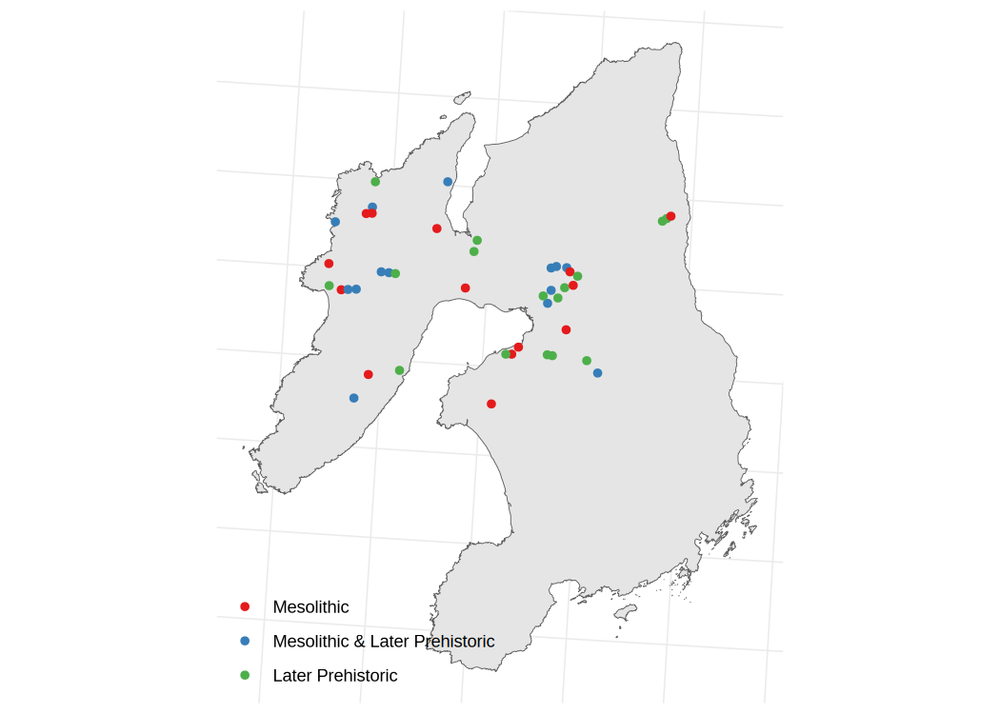

<!-- README.md is generated from README.Rmd. Please edit that file -->

# islay

<!-- badges: start -->
<!-- badges: end -->

The goal of the islay package is to provide a high-quality teaching
dataset for archaeologists using R. It includes various datasets
relating to the prehistoric archaeology of the Scottish island of Islay
(pronounced “EYE-luh”) and recorded by the ‘Southern Hebrides Mesolithic
Project’ (Mithen et al. 2000).



## Installation

You can install the development version of islay from
[GitHub](https://github.com/) with:

``` r
# install.packages("devtools")
devtools::install_github("joeroe/islay")
```

## Example

The package currently includes one dataset, `islay_sites`:

``` r
library(islay)
islay_sites
#> # A tibble: 44 × 7
#>    site_code         site_name         period     longi…¹ latit…² total…³ source
#>    <chr>             <chr>             <chr>        <dbl>   <dbl>   <dbl> <chr> 
#>  1 Black Park Quarry Black Park Quarry Mesolithic   -6.32    55.8      NA <NA>  
#>  2 GRU1              Gruinart 1        Later Pre…   -6.32    55.8      31 Field…
#>  3 GRU9              Gruinart 9        Later Pre…   -6.31    55.8      35 Field…
#>  4 Aoradh            Aoradh            Mesolithic   -6.35    55.8      NA <NA>  
#>  5 Killellan         Killellan         Mesolithi…   -6.35    55.9      NA <NA>  
#>  6 KRD2              Kindrochid 2      Mesolithi…   -6.42    55.8     186 Field…
#>  7 Sanaigmore        Sanaigmore        Later Pre…   -6.42    55.8      NA <NA>  
#>  8 Kindrochid ditch  Kindrochid ditch  Mesolithic   -6.42    55.8      NA <NA>  
#>  9 KRD4              Kindrochid 4      Mesolithic   -6.42    55.8      NA Colle…
#> 10 KRD3              Kindrochid 3      Mesolithi…   -6.46    55.8     103 Field…
#> # … with 34 more rows, and abbreviated variable names ¹​longitude, ²​latitude,
#> #   ³​total_chipped_stone
```
